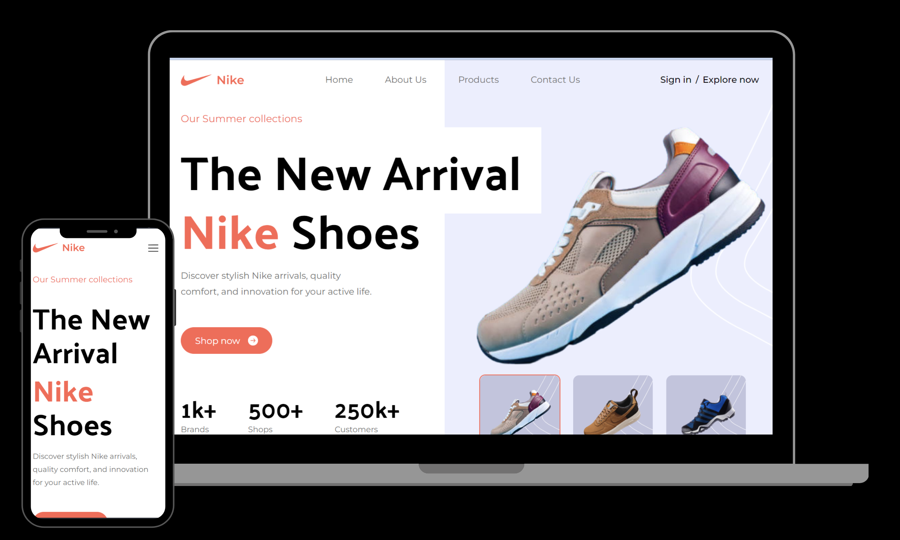

 

 

  

    
    
  

  <h3 align="center">Nike Website</h3>

## 🤖 Introduction

Master Tailwind CSS in two parts by first learning fundamentals, advanced techniques, and theming. Then, build a stunning Nike landing page, applying learned skills to create a visually impressive website.

## 🚨 Shoutout

- Thank you, JavaScript Mastery for the reference and ideas.

## ⚙️ Tech Stack

- React.js
- Tailwind CSS

## 🔋 Features

👉 Maximizing Tailwind CSS: Discover tips and tricks to make the most out of Tailwind CSS.

👉 Understanding Tailwind Internals: Dive into the inner workings of Tailwind, gaining insights into its structure and optimizations.

👉 Best Practices: Learn Tailwind's best practices for efficient and maintainable code.

👉 Theming:Explore techniques to add different themes to your website using Tailwind CSS.

👉 JavaScript-like Tasks with Tailwind: Discover how Tailwind CSS can be used to achieve tasks that typically require JavaScript code

while building a beautiful Nike Website with a,

👉 Complex Hero Section: A visually appealing hero section showcasing key elements.

👉 Popular Products Showcase: A section highlighting popular Nike products

👉 About Us Section: An informative "About Us" section with a unique design.

👉 Special Offers: Showcase special offers in an eye-catching manner

👉 Testimonials: A testimonials section for a captivating user experience

👉 Newsletter Integration: A newsletter section with Tailwind styling, encouraging user engagement

👉 Footer: A comprehensive footer section containing various links

👉 Mobile Responsive: The entire website is responsive across various devices, emphasizing Tailwind's mobile-friendly capabilities.

and many more, including code architecture and reusability
